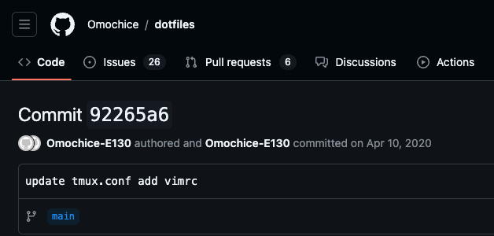

# .vimrc and my belief about it

VimConf2024 LT

<!--
vimrcとそれについての私の信念
-->

---

## Notices

This presentation is only _my opinion_

<!--
最初におねがいです

このプレゼンは私の個人的な信念についてのものなので、この会場にいる皆さん全員に適用できる考え方ではないと思っています

なので、自分は違うな、であったり、そうは思わないなと思ったらその内容をまとめて記事とかにしてもらえるととてもうれしいです
-->

---

## Who is this speaker?

<!-- 自己紹介をします -->

---

Omochice

3 years of employment as a system enginner

<!--
おもちあいす です

普段はひだりのハリセンボンのアイコンで活動しています

今年で社会人3年目になるシステムエンジニアです
-->

---

### My initial commit for .vimrc

<!--
次に私とvimについてです

このスライドを書くにあたってvimrcのinitial commitを探してみたところ
4年前、2020/04が初期commitでした

ここから私のvim life, すなわちvim生が始まったといえるでしょう

余談ですが、この時点のvimrcはプラグイン管理をvim-plug, 補完はYouCompleteMeとjedi-vimみたいな構成でした
-->

---

### Life stage has changed

<!--
このinitial commitから4年のVim生の間で私のライフステージは変化しました
-->

---

#### Student to Working adult

<!--
具体的には学生から社会人へと変化しています
-->

---

#### Changes about Vim

- Lost time for trying vim plugins and re-inventing
- "Hobby tool" to "Tool for making money"

<!--
これは

- vimのプラグインを試したり再発明する時間が無くなったこと

であったり

- vimが"趣味のツール"から"お金を稼ぐためのツール"へ変化したこと

を意味します
-->

---

## My belief has changed

<!--
この変化に合わせて私のvimrcに対する信念も変化したのでそれについておはなしします

-->

---

### Changes

- Want to handle all task in Vim
  => Want to call other tools for vim non-friendly data
- Search plugins from online hosting services
  => Learn plugins from other person's vimrc

<!--
まず変化したものについてです

- 働きはじめてから、Vimから扱いにくいデータに触れることが増えたので、すべてをVimの中から扱うのではなく、他のツールとどう協調させてVimから扱うかを考えています
    - 具体的にはAPIなどがある場合はそれとどうvimを繋げるか、なければvimで扱いやすい形式にどうやって変換するかを考えています
        - 最近だとShougoさんのddu.vimでRedmineのチケットを扱うためのsourceを作っていたりします
- 次に、プラグインについて調べるときにプラグインそのもののコードを読むのと同じぐらいの割合で
そのプラグインが他の人のvimrcでどう使われているかを調べるようになりました
    - 余談ですが、他の人のvimrcを読むとvim/nvim両方でうごかそうとしているなどその人の信念が見えることがあって面白いです

他人のvimrcを読んで信念を理解しようとする試みですが
-->

---

https://vim-jp.org/reading-vimrc/

<!--
- 毎週土曜日の夜23時からやっているvimrc読書会というものがあります

Vimmerが読みたいと思ったvimrcをみんなで読んでそれについて色々おはなしする会です

予定通りであれば今日もやるらしいので興味がある方は参加してみてください
-->

---

### Not changes

- Vim should not cut off my thought
- Keep plugins latest
- Explicitly rather than implicitly

<!--
はなしをもどして, 次に変わらなかったものについてです

- まず、vimの挙動が私の思考をさえぎらないように設定をしています
    - 派手なエフェクトも綺麗ですが、気がちらない程度にとどめています
- プラグインはできるかぎりで最新を保つようにしています
    - Vimを動かしている環境などはすべて刻一刻と変化しつづけています
    - それらの変化に追従して初めて現状維持であると考えています
- 暗黙で設定されるのではなく、明示的に設定するようにしています
    - Vimにはビルトインで設定されているマッピングなど便利なものが沢山あります
        - 便利ですが意図せずオペレータ待機になったりして思考が止められるの苦手なので自分でハンドリングできる範囲のものだけ残すようにしています
-->

---

## Q.

<!--
さて、ここまで私の信念についておはなしをしてきましたが、ここでみなさんに質問です
-->

---

## What is your belief about vimrc?

<!--
NOTE: このへんで4min+ちょっとぐらいがいいな

皆様の自身のvimrcについての信念はなんでしょうか？
-->

---

### Examples...

- Handling all tasks in vim
- Harmonize vim with other tools
- Customize all configurations
- Use default features

etc...

<!--
例えば

- 全ての作業をvimの中で完結させる
- 他のツールとvimを協調して動かす
- カスタマイズを極めて最強のvimを作る
- vim本体に搭載の機能だけを使う

などなど様々な信念がありそうですが
-->

---

### After all...

<!-- 結局のところ -->

---

### All your needs is known by you only

<!--
自分が求めているものは自分のなかにしか無いのだと思います

なので、最初に述べたように、今日の私の発表が自分の信念と違うなと思ったらブログなどで表現してみてほしいです。
色々な信念があると思いますし、 それを許容できる風土がこのvimコミュニティにはあるんじゃないかなと思っています
-->

---

### Have a good vim journy!

<!-- 最後に,皆さんとvimの旅路がいいものであることを願って -->

---

## `:wq`

<!--
:wq でこのLTを終了します

ありがとうございました
-->
